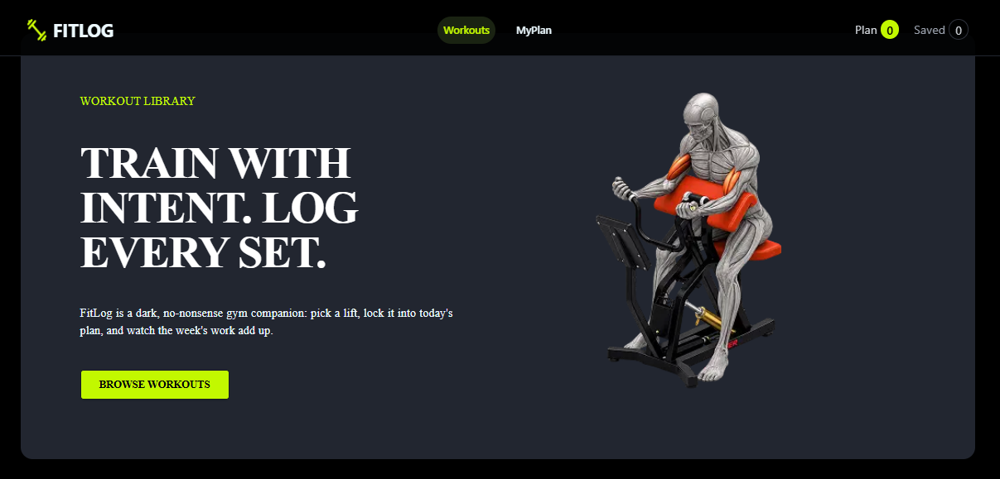

# Fit Log

Fit Log is a modern fitness and workout tracking web application that helps users discover workouts, save their favorite exercises, and organize their fitness activities in one place.

## 🚀 Technologies Used

- **Next.js** – React framework for building the application
- **React** – Building interactive user interfaces
- **Tailwind CSS** – Styling and responsive design
- **DaisyUI** – Pre-built UI components and design utilities
- **React Icons** – Icons throughout the application
- **Context API** – Managing application state
- **Next/Image** – Optimized image handling

## ✨ Key Features

1. **Workout Discovery**
   - Browse and explore different workouts and exercises.
   - View useful workout information such as difficulty, duration, and category.

2. **Save Favorite Workouts**
   - Save favorite workouts for quick access.
   - Manage saved workouts from a dedicated section.

3. **Workout Management**
   - Add workouts to your personal list.
   - Remove individual workouts when they are no longer needed.

4. **Responsive & Modern UI**
   - Built with Tailwind CSS and DaisyUI.
   - Responsive design that works smoothly across desktop, tablet, and mobile devices.

5. **Interactive User Experience**
   - Clean and intuitive interface with reusable React components.
   - Interactive actions and notifications provide clear feedback to users.

### 🖥️ Project Preview

## 🎯 Project Purpose

The goal of Fit Log is to provide a simple and user-friendly platform for discovering and organizing workouts while practicing modern web development technologies such as Next.js, React, Tailwind CSS, and DaisyUI.
